# Output directory structure

These files will be created in the directory specified with the `--outdir` parameter

 * [app.R](#Shiny-app)
 * [aradeepopsis_traits.csv](#Trait-table)
 * [diagnostics](#Diagnostics)
    * [convex_hull](#Convex-Hull)
    * [crop](#Crop)
    * [mask](#Mask)
    * [overlay](#Overlay)
    * [summary](#Summary)
        * [mask](#Summary-Mask)
        * [crop](#Summary-Crop)
        * [overlay](#Summary-Overlay)
 * [www](#www)

## Shiny app

The Shiny app that is automatically launched at the end of a pipeline run. It allows to interactively explore pipeline results.

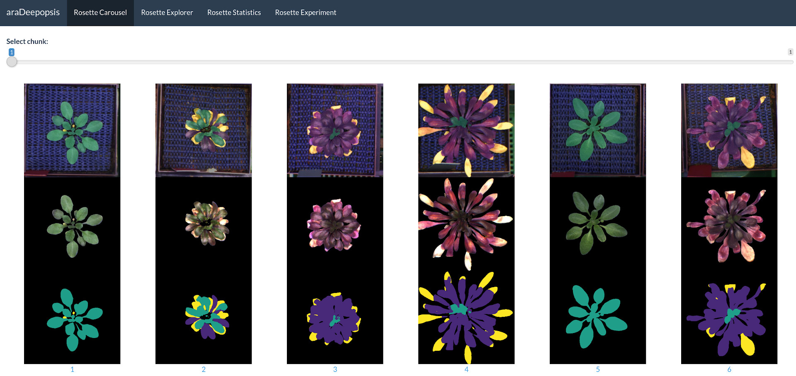

> Note that the shiny app can also be run manually as described [here](parameters.md#--shiny).

## Trait table

The main result of the pipeline. It includes a total of 78 traits.

|file        |format|plant_region_red_channel|plant_region_green_channel|plant_region_blue_channel|plant_region_chroma_ratio|plant_region_chroma_difference|plant_region_chroma_base|plant_region_green_strength|plant_region_blue_green_ratio|total_area|class_background_area|plant_region_area|plant_region_filled_area|plant_region_convex_area|plant_region_equivalent_diameter|plant_region_major_axis_length|plant_region_minor_axis_length|plant_region_perimeter|plant_region_eccentricity|plant_region_extent|plant_region_solidity|plant_region_aspect_ratio|class_norm_area|class_norm_filled_area|class_norm_convex_area|class_norm_equivalent_diameter|class_norm_major_axis_length|class_norm_minor_axis_length|class_norm_perimeter|class_norm_eccentricity|class_norm_extent |class_norm_solidity|class_norm_aspect_ratio|class_norm_red_channel|class_norm_green_channel|class_norm_blue_channel|class_norm_chroma_ratio|class_norm_chroma_difference|class_norm_chroma_base|class_norm_green_strength|class_norm_blue_green_ratio|class_senesc_area|class_senesc_filled_area|class_senesc_convex_area|class_senesc_equivalent_diameter|class_senesc_major_axis_length|class_senesc_minor_axis_length|class_senesc_perimeter|class_senesc_eccentricity|class_senesc_extent|class_senesc_solidity|class_senesc_aspect_ratio|class_senesc_red_channel|class_senesc_green_channel|class_senesc_blue_channel|class_senesc_chroma_ratio|class_senesc_chroma_difference|class_senesc_chroma_base|class_senesc_green_strength|class_senesc_blue_green_ratio|class_antho_area |class_antho_filled_area|class_antho_convex_area|class_antho_equivalent_diameter|class_antho_major_axis_length|class_antho_minor_axis_length|class_antho_perimeter|class_antho_eccentricity|class_antho_extent|class_antho_solidity|class_antho_aspect_ratio|class_antho_red_channel|class_antho_green_channel|class_antho_blue_channel|class_antho_chroma_ratio|class_antho_chroma_difference|class_antho_chroma_base|class_antho_green_strength|class_antho_blue_green_ratio|
|------------|------|------------------------|--------------------------|-------------------------|-------------------------|------------------------------|------------------------|---------------------------|-----------------------------|----------|---------------------|-----------------|------------------------|------------------------|--------------------------------|------------------------------|------------------------------|----------------------|-------------------------|-------------------|---------------------|-------------------------|---------------|----------------------|----------------------|------------------------------|----------------------------|----------------------------|--------------------|-----------------------|------------------|-------------------|-----------------------|----------------------|------------------------|-----------------------|-----------------------|----------------------------|----------------------|-------------------------|---------------------------|-----------------|------------------------|------------------------|--------------------------------|------------------------------|------------------------------|----------------------|-------------------------|-------------------|---------------------|-------------------------|------------------------|--------------------------|-------------------------|-------------------------|------------------------------|------------------------|---------------------------|-----------------------------|-----------------|-----------------------|-----------------------|-------------------------------|-----------------------------|-----------------------------|---------------------|------------------------|------------------|--------------------|------------------------|-----------------------|-------------------------|------------------------|------------------------|-----------------------------|-----------------------|--------------------------|----------------------------|
|1           |png   |99.7535697835099        |126.85610317825886        |93.1953707968678         |1.3149188878330613       |-30.38163288807               |1.5210063666329467      |0.39666698713482385        |0.7346542141997628           |295872    |252088               |43420            |43420                   |74876                   |235.1256281914006               |337.28373985034574            |280.94370163968136            |2842.266340221731     |0.5533339317860381       |0.3790153631284916 |0.5798920882525775   |1.2005385345243373       |43420          |43420                 |74876                 |235.1256281914006             |337.28373985034574          |280.94370163968136          |2842.266340221731   |0.5533339317860381     |0.3790153631284916|0.5798920882525775 |1.2005385345243373     |99.7535697835099      |126.85610317825886      |93.1953707968678       |1.3149188878330613     |-30.38163288807             |1.5210063666329467    |0.39666698713482385      |0.7346542141997628         |364              |364                     |4878                    |21.528102431092233              |118.79161550599903            |57.90022379861881             |108.84062043356593    |0.8731732196472067       |0.033734939759036145|0.07462074620746208  |2.051660731384475        |151.60164835164835      |146.17582417582418        |102.5                    |1.1505303104018683       |-19.125                       |1.7383288227334235      |0.3651862375687195         |0.7012103443091264           |0                |0                      |0                      |nan                            |nan                          |nan                          |nan                  |nan                     |nan               |nan                 |nan                     |nan                    |nan                      |nan                     |nan                     |nan                          |nan                    |nan                       |nan                         |
|2           |png   |101.51583105439076      |94.147645092677           |72.06311151625646        |1.0847818715609308       |-7.3581738073533955           |1.8436886275783073      |0.3516559409148823         |0.7654265961227072           |295872    |253178               |32910            |33290                   |49295                   |204.70054571796874              |249.0253277199329             |226.85573677295378            |2268.613490585595     |0.41246255897980133      |0.5141544806899138 |0.6676133482097576   |1.0977255028342852       |19641          |20071                 |37765                 |158.13822402614534            |243.5850984756978           |192.0965839059821           |1678.7646814565664  |0.6148782278468807     |0.38401830055136277|0.5200847345425659 |1.268034514319712      |99.8897713965684      |100.23354208034215      |69.94267094343465      |1.180381565492363      |-15.317320910340612         |1.6943673626127465    |0.37114463820935434      |0.6977970596646393         |9784             |9784                    |43914                   |111.6126144559334               |297.684598907779              |238.1577090039546             |1840.238815542512     |0.5999550734143577       |0.17297526651698106|0.2227991073461766   |1.2499473569542774       |181.04732215862632      |147.45860588716272        |118.13000817661488       |0.9857605569374454       |2.1300592804578855            |2.028890267443432       |0.33015392163548435        |0.8011062322602557           |13269            |13269                  |40074                  |129.97928880822082             |263.4953771674782            |218.30785211698048           |1249.9341622907673   |0.5599782135538464      |0.20730221222347206|0.3311124419823327  |1.2069899209410202      |103.92275227974979     |85.1391966237094         |75.2018237998342        |0.9506143544019616      |4.423091416082599            |2.1039025875621395     |0.322175059232583         |0.8832808715849704          |
|3           |png   |108.62245148181881      |64.93773208155258         |85.61668885307924        |0.6686369386683856       |32.181838085896445            |2.9911599020883766      |0.2505537298760567         |1.318442854541899            |295872    |231465               |57092            |59107                   |66287                   |269.61415409436484              |282.5393177149983             |275.3537751428984             |2252.772870152029     |0.22409201595728792      |0.6452094116583414 |0.8612850181785268   |1.0260956748036987       |1916           |1916                  |2629                  |49.391567779455755            |84.53543546012013           |39.44852380148291           |288.492424049175    |0.8844416790722189     |0.4344671201814059|0.7287942183339673 |2.142930262372514      |54.258872651356995    |43.45198329853862       |38.906054279749476     |0.9327970241563215     |3.1304801670146105          |2.1440891728925937    |0.3180571367446267       |0.89538040214284           |7315             |7315                    |74192                   |96.50775756247637               |446.15984262710236            |368.77434463230827            |1426.7747827243331    |0.562860252529645        |0.07713071626651483|0.09859553590683631  |1.2098451237760381       |214.53465481886533      |149.2384142173616         |167.21435406698563       |0.7818666754521229       |41.63609022556389             |2.5579808716664876      |0.2810582844790899         |1.1204511582617234           |55176            |59107                  |66287                  |265.05143863089546             |287.15623600302183           |279.6677112463133            |2383.412480458819    |0.22688405626546063     |0.6235562687882829|0.8323804064145307  |1.0267765081758513      |110.51023995940264     |65.68382992605481        |87.23872698274612       |0.6643152775131367      |33.19065354501956            |3.0106187042498815     |0.2493380881459368        |1.3281613919431503          |
|4           |png   |111.70213353269308      |54.769555466099256        |69.44015182011617        |0.6047130890440635       |35.80158721030538             |3.3073535801277596      |0.2321611127104962         |1.267860424083551            |295872    |179415               |86945            |88760                   |137905                  |332.7188185495355               |420.9388337170134             |375.5729285951652             |5858.3327163372105    |0.4515874805735622       |0.44814700273181796|0.6304702512599253   |1.1207912010366132       |4618           |4618                  |11644                 |76.6799857693452              |129.0989850974666           |86.86193146231405           |688.4467888754755   |0.7397952873883376     |0.284604955010477 |0.3965991068361388 |1.4862550593118866     |46.969034213945434    |37.82459939367692       |33.35708098744045      |0.9417758919087955     |2.338458207016018           |2.1236474804492937    |0.3201385579707489       |0.8818885466640712         |29512            |29514                   |221347                  |193.84490048547607              |697.0170486153787             |573.5354717863108             |3107.4328624631016    |0.5682690370730274       |0.10330511975020827|0.13332911672622624  |1.2152989359916608       |228.63516535646517      |183.52012740580102        |169.83809975603145       |0.9211163883428404       |15.71650515044729             |2.171278272008768       |0.3153302593551888         |0.9254467188794188           |82327            |84145                  |137905                 |323.7622460995286              |430.53517634575854           |385.094631093112             |6084.392636860784    |0.44715662610668927     |0.42434410597391886|0.59698343062253    |1.117998386847568       |115.3332321109721      |55.72005538887607        |71.46417335746474       |0.5965827549814773      |37.67864734534236            |3.3524267728156105     |0.2297568809763327        |1.2825574716088999          |
|5           |png   |73.44000517196794       |97.80629132956518         |62.51501717832207        |1.4388036519543341       |-29.828780154420187           |1.3900437334054512      |0.41840238570662097        |0.6391717376101432           |295872    |241734               |54138            |54216                   |90528                   |262.5464577420008               |340.861057612292              |332.22817379633966            |3066.5638507985386    |0.22363351094797934      |0.42607545922463047|0.5980249204665959   |1.0259848035080985       |54138          |54216                 |90528                 |262.5464577420008             |340.861057612292            |332.22817379633966          |3066.5638507985386  |0.22363351094797934    |0.42607545922463047|0.5980249204665959 |1.0259848035080985     |73.44000517196794     |97.80629132956518       |62.51501717832207      |1.4388036519543341     |-29.828780154420187         |1.3900437334054512    |0.41840238570662097      |0.6391717376101432         |0                |0                       |0                       |nan                             |nan                           |nan                           |nan                   |nan                      |nan                |nan                  |nan                      |nan                     |nan                       |nan                      |nan                      |nan                           |nan                     |nan                        |nan                          |0                |0                      |0                      |nan                            |nan                          |nan                          |nan                  |nan                     |nan               |nan                 |nan                     |nan                    |nan                      |nan                     |nan                     |nan                          |nan                    |nan                       |nan                         |
|6           |png   |110.51932698278792      |62.721208712667114        |79.72029479653649        |0.6593916464512628       |32.39860217699509             |3.0330987824363116      |0.24794830326370548        |1.2710261239024283           |295872    |199546               |85347            |88796                   |134622                  |329.6470467401641               |386.5541628985788             |368.2250540537557             |4409.001584426775     |0.30427781368429097      |0.45090342349957735|0.6339751303650221   |1.0497769194220752       |4149           |4149                  |5231                  |72.68198450170571             |113.65867058658988          |59.35338059729336           |368.19090885900994  |0.852818620312283      |0.490715552927262 |0.7931561842859873 |1.9149485579895167     |53.84646902868161     |48.90961677512654       |42.10122921185828      |1.0195057864235706     |-0.9357676548565905         |1.961734819589407     |0.3376399512156975       |0.8607965465243488         |10979            |10979                   |109781                  |118.23238541807127              |565.4087715222331             |318.9288386884033             |1129.6082604829626    |0.8257285287115241       |0.07754188208040229|0.10000819813993314  |1.7728367677488182       |219.75799253119592      |163.97395026869478        |141.17752072137716       |0.9086052452475086       |16.49380635759175             |2.201175934720903       |0.3123852048098024         |0.860975298149722            |81198            |81993                  |134622                 |321.5346086401987              |395.7318516118371            |376.875437230469             |4490.729506488133    |0.30500569617415274     |0.42898351648351646|0.6031555020724696  |1.0500335456190448      |113.41515800881795     |63.42694401339934        |81.64252814108723       |0.6503403712546313      |34.10189906155325            |3.0753126953223227     |0.24537994376426825       |1.2871900012057924          |

Traits are calculated per class and within the plant region that, by default, includes all classes except senescence.

> Note that this is controlled by the `--ignore_senescence` parameter.

### Color channel quantification

These traits are based on the color channel information of the original plant images within the region of the segmented mask. Color indices are calculated as described in [Del Valle et al. 2018](https://doi.org/10.1002/ece3.3804).

#### {class_norm|class_senesc|class_antho|plant_region}_{red|green|blue}_channel

Mean of {red|green|blue} channel intensities within the mask region of the original image.

#### {class_norm|class_senesc|class_antho|plant_region}_chroma_base

#### {class_norm|class_senesc|class_antho|plant_region}_chroma_ratio

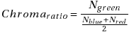

#### {class_norm|class_senesc|class_antho|plant_region}_chroma_difference

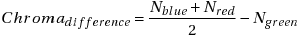

#### {class_norm|class_senesc|class_antho|plant_region}_green_strength

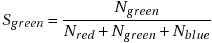

#### {class_norm|class_senesc|class_antho|plant_region}_blue_green_ratio

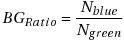

### Morphometric traits

These traits are calculated for each classified region using scikit-image.
Please refer to the relevant sections of the [scikit-image documentation](https://scikit-image.org/docs/0.16.x/api/skimage.measure.html#regionprops) for further information.

#### {class_norm|class_senesc|class_antho|plant_region}_area

Number of pixels of the region.

#### {class_norm|class_senesc|class_antho|plant_region}_filled_area

Number of pixels of the region will all the holes filled in.

#### {class_norm|class_senesc|class_antho|plant_region}_convex_area

Number of pixels of convex hull image, which is the smallest convex polygon that encloses the region.

#### {class_norm|class_senesc|class_antho|plant_region}_equivalent_diameter

The diameter of a circle with the same area as the region.

#### {class_norm|class_senesc|class_antho|plant_region}_major_axis_length

The length of the major axis of the ellipse that has the same normalized second central moments as the region.

#### {class_norm|class_senesc|class_antho|plant_region}_minor_axis_length

The length of the minor axis of the ellipse that has the same normalized second central moments as the region.

#### {class_norm|class_senesc|class_antho|plant_region}_aspect_ratio

The aspect ratio of the ellipse enclosing the region.

#### {class_norm|class_senesc|class_antho|plant_region}_solidity

Ratio of pixels in the region to pixels of the convex hull image.

#### {class_norm|class_senesc|class_antho|plant_region}_eccentricity

Eccentricity of the ellipse that has the same second-moments as the region. The eccentricity is the ratio of the focal distance (distance between focal points) over the major axis length. The value is in the interval [0, 1]. When it is 0, the ellipse becomes a circle.

#### {class_norm|class_senesc|class_antho|plant_region}_extent

Ratio of pixels in the region to pixels in the total bounding box. 

#### {class_norm|class_senesc|class_antho|plant_region}_perimeter

Perimeter of object which approximates the contour as a line through the centers of border pixels using a 4-connectivity.

## Diagnostics

This folder contains diagnostic images for each processed input image.

#### Convex Hull

> Note that the `--ignore_senescence` parameter controls whether senescent leaves are included in the calculation of the convex hull.

#### Crop

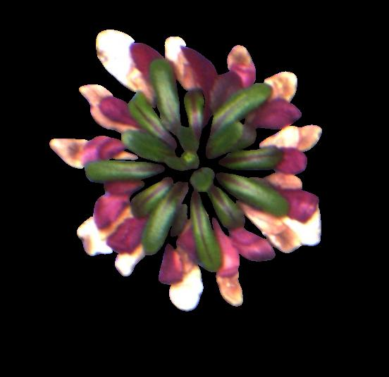

#### Mask

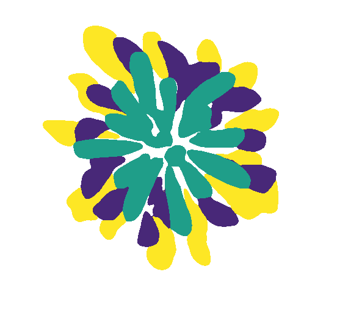
#### Overlay

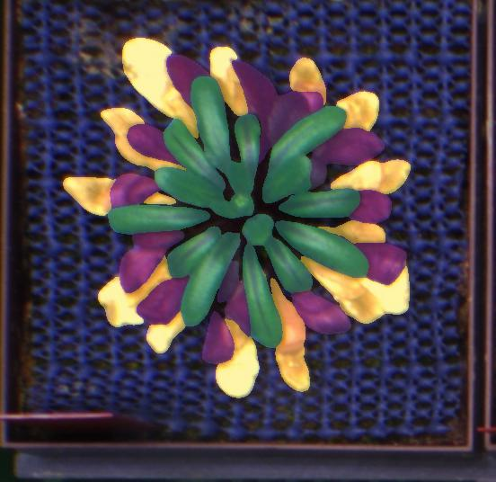

## Summary

This folder contains diagnostic images summarised for each chunk of processed images (number of images is controlled by the `--chunksize` parameter)

> Note that the creation of these files depends on the `--summary_diagnostics` parameter that is set to `false` by default.

#### Summary Crop

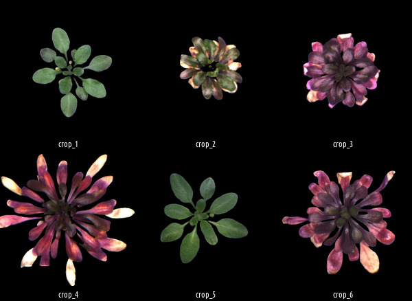

#### Summary Mask

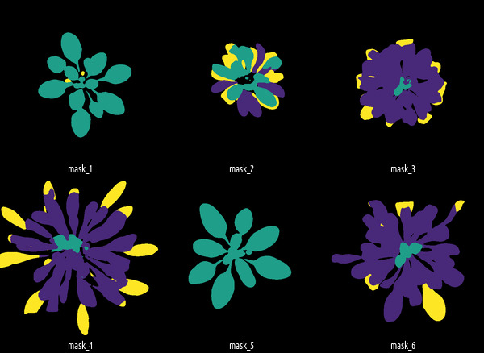

#### Summary Overlay

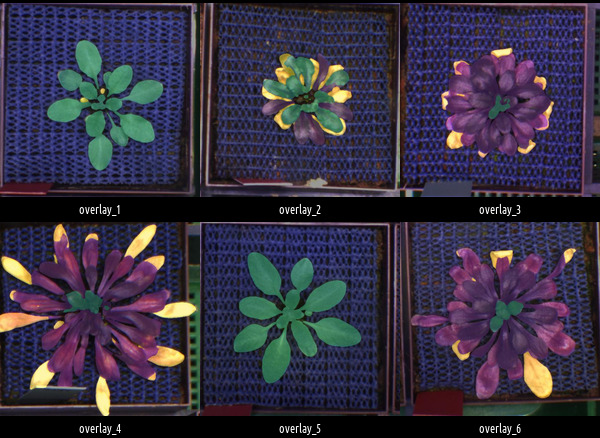

## www

This folder contains reports that are generated by Nextflow.