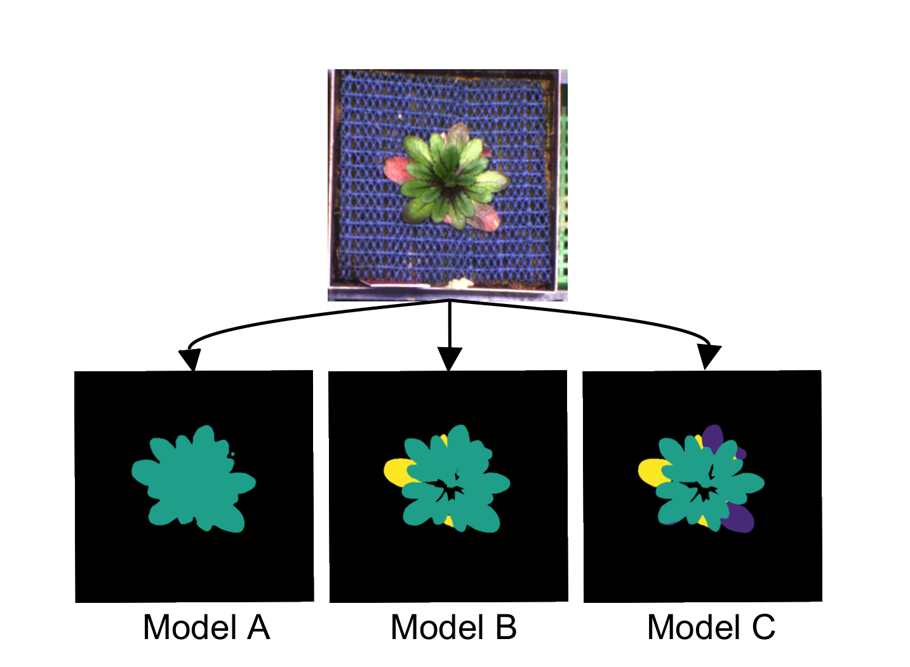

# Table of contents

* [Pipeline parameters](#main)
    * [`--images`](#--images)
    * [`--model`](#--model)
    * [`--masks`](#--masks)
    * [`--label_spec`](#--label_spec)
    * [`--multiscale`](#--multiscale)
    * [`--chunksize`](#--chunksize)
    * [`--ignore_senescence`](#--ignore_senescence)
    * [`--ignore_label`](#--ignore_label)
    * [`--outdir`](#--outdir)
    * [`--save_overlay`](#--save_overlay)
    * [`--save_mask`](#--save_mask)
    * [`--save_rosette`](#--save_rosette)
    * [`--save_hull`](#--save_hull)
    * [`--summary_diagnostics`](#--summary_diagnostics)
    * [`--shiny`](#--shiny)

## --images

Path to the images to be analysed. Supported image formats include PNG and JPEG.

> Note that the path has to be enclosed in quotes and include a glob pattern that matches the images e.g. `--images '/path/to/images/*png'`

## --model

> Note that this parameter is _ignored_ if `--masks` is set.

The pretrained model that is used for image segmentation to produce segmentation masks that are subsequently used to extract morphometric and colorimetric traits.

### Pretrained models for semantic segmentation of leaf classes based on DeepLabv3+ [](https://doi.org/10.5281/zenodo.3946618)


Currently, there are 3 available models that will classify pixels based on the leaf classes they were trained on.

* `--model 'A'`: trained on ground truth annotations for ordinary leaves (class_norm) only
* `--model 'B'`: trained on ground truth annotations for ordinary (class_norm) and senescent (class_senesc) leaves
* `--model 'C'`: trained on ground truth annotations for ordinary (class_norm), and senescent (class_senesc) and anthocyanin-rich (class_antho) leaves



### Custom models

The pipeline can also use models that were trained with [Deep Plant Phenomics](https://github.com/p2irc/deepplantphenomics) to obtain segmentation masks that can then be used for trait extraction further downstream in the pipeline.

* `--model 'DPP'`: uses the pretrained [checkpoint](https://github.com/p2irc/deepplantphenomics/tree/2.1.0/deepplantphenomics/network_states/vegetation-segmentation-network) of the [Vegetation Segmentation](https://deep-plant-phenomics.readthedocs.io/en/latest/Tools/#vegetation-segmentation-network) model provided by DPP

> Note that custom training checkpoints can be specified with the `--dpp_checkpoint` parameter.
> Currently, only 2-class models (background and plant) are supported.

### --ignore_label

If using custom models or supplying already segmented masks, it can be desirable to ignore certain segmentation classes.
Similar to `--ignore_senescence`, setting this parameter to the pixel value of the class to be ignored, will exclude those pixels from the calculation of morphometric traits.

### --ignore_senescence

> Note that this parameter only affects models `B` & `C` and will be _ignored_ otherwise.

Ignore senescent class when calculating morphometric traits, focussing on living tissue only.

### --multiscale

> Note that this parameter is _ignored_ if `--masks` is set.

Specifies whether the input image is scaled during model prediction. This yields higher accuracy at the cost of higher computational demand.

## --masks

Path to grayscale segmentation masks corresponding to the images supplied with `--images`.
When this parameter is set, the pipeline **will not** perform semantic segmentation using a trained model,
it will only extract morphometric traits based on the user-supplied masks.

> Note that the path has to be enclosed in quotes and include a glob pattern that matches the images e.g. `--masks '/path/to/masks/*png'`.

### --label_spec

> Note that this parameter is _required_ if `--masks` is set and _ignored_ otherwise.

Specifies a comma-separated list of `key=value` pairs of segmentation classes and their corresponding pixel values.
Key is an arbitrary name and value is the corresponding grayscale pixel value in the supplied segmentation masks.

> Note that the value of the background class has to be zero and the list has to be enclosed in quotes, e.g
> `--label_spec 'class_background=0,class_norm=255'` 

## --chunksize

The number of images in each chunk, determining the degree of parallelization.
The smaller the chunksize, the more jobs will be spawned.

## --outdir

The directory that results will be saved to.

## --save_overlay

Save overlays of the original images with the segmentation masks to the results directory.

## --save_mask

Save the segmentation masks to the results directory.

## --save_rosette

Save rosette images that were cropped to the region of interest to the results directory.

## --save_hull

Save convex hull images to the results directory.

## --summary_diagnostics

Merge individual overlays, masks and rosette images into larger summaries that allow for quick inspection of results.

## --shiny

Launch a [Shiny](https://shiny.rstudio.com/) app as the last step of the pipeline, allowing for interactive inspection of results. 

> Note that the app will run on the host where the main Nextflow process is running.
> If you are running the pipeline on a remote server, it has to expose port 44333 to the network.
>
> If this is not the case, the shiny app can also be run manually on a local computer from the results directory.
> This has to happen from within the container or conda environment, respectively.
> ```bash
> # change to results directory (needs to be copied to local file system first)
> cd /path/to/results
>
> # if using the conda environment
> conda create -f /path/to/cloned/repository/environment.yml
> conda activate aradeepopsis
> R -e "shiny::runApp('app.R', port=44333)"
>
> # if using the container image
> {docker|podman} run -v $(pwd):/mnt/shiny -p 44333:44333 quay.io/beckerlab/aradeepopsis-shiny:1.3 R -e "shiny::runApp('/mnt/shiny/app.R', port=44333, host='0.0.0.0')"
> ```
> The shiny app can then be opened in a browser by typing localhost:44333 in the address bar. It will terminate when the browser window is closed.
